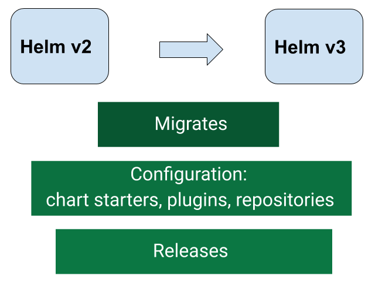

# Helm 2to3 Plugin

[](https://opensource.org/licenses/Apache-2.0)
[](https://goreportcard.com/report/github.com/helm/helm-2to3)
[](https://circleci.com/gh/helm/helm-2to3/tree/master)
[](https://github.com/helm/helm-2to3/releases/latest)



**Helm v3 plugin which migrates and cleans up Helm v2 configuration and releases in-place to Helm v3**

## Overview

One of the most important aspects of upgrading to a new major release of Helm is the
migration of data. This is especially true of Helm v2 to v3 considering the architectural
changes between the releases. The `2to3` plugin helps with this migration by supporting:
- Migration of [Helm v2 configuration](#migrate-helm-v2-configuration).
- Migration of [Helm v2 releases](#migrate-helm-v2-releases).
- [Clean up](#clean-up-helm-v2-data) Helm v2 configuration, release data and Tiller deployment.

## Readme before migration

***WARNING:*** All data migrations carry a level of risk. Helm v2 migration is no different.
You should be aware of any risks specific to your environment and prepare a data migration
strategy for your needs.

Here are some suggestions to mitigate against potential risks during migration:
- Perform a data backup of the following:
  - Helm v2 home folder.
  - Release data from the cluster. Refer to [How Helm Uses ConfigMaps to Store Data](http://technosophos.com/2017/03/23/how-helm-uses-configmaps-to-store-data.html)
  for details on how Helm v2 store release data in the cluster. This should apply
  similarly if Helm v2 is configured for secrets.
- Avoid performing operations with Helm v3 until data migration is complete and you are
  satisfied that it is working as expected. Otherwise, Helm v3 data might be overwritten.
  The operations to avoid are chart install, adding repositories, plugin install etc.
- The recommended data migration path is as follows:
  1. Backup v2 data, as suggested above.
  2. Migrate [Helm v2 configuration](#migrate-helm-v2-configuration).
  3. Migrate [Helm v2 releases](#migrate-helm-v2-releases).
  4. When happy that Helm v3 is managing Helm v2 data as expected, then [clean up](#clean-up-helm-v2-data) Helm v2 data.
     *Note:*: Only use the plugin to do clean up. Using `helm`, `kubectl` or other tools could lead to data loss and an indeterminate
      state for the release(s).

**Note:**
A Helm v2 client:
- can manage 1 to many Kubernetes clusters.
- can connect to 1 to many Tiller instances for  a cluster.

This means that you have to cognisant of this when migrating as releases are deployed into clusters by Tiller and
its namespace. You have to therefore be aware of migrating for each cluster and each Tiller instance that is managed
by the Helm v2 client instance. [Clean up](#clean-up-helm-v2-data) should only be run once all migration for a Helm v2 client is complete.

## Prerequisite

- Helm v2 client installed on a system which manages releases on one to many clusters
- Helm v3 client with `2to3` plugin installed on the same system
- Access to the cluster(s) that Helm v2 client is managing and which Helm v3 will manage after migration. This access is similar to `kubectl` access using [kubeconfig files](https://kubernetes.io/docs/concepts/configuration/organize-cluster-access-kubeconfig/). **Note:** If using the `KUBECONFIG` environment value, the plugin only supports a single **kubeconfig** file and not a list of them

## Install

Based on the version in `plugin.yaml`, release binary will be downloaded from GitHub:

```console
$ helm plugin install https://github.com/helm/helm-2to3
Downloading and installing helm-2to3 v0.1.3 ...
https://github.com/helm/helm-2to3/releases/download/v0.1.3/helm-2to3_0.1.3_darwin_amd64.tar.gz
Installed plugin: 2to3
```

## Usage

### Migrate Helm v2 configuration

Migrate Helm v2 configuration in-place to Helm v3:

```console
$ helm 2to3 move config [flags]
```

Flags:

```
      --dry-run  simulate a command
  -h, --help     help for move
```

It will migrate:
- Chart starters
- Repositories
- Plugins

**Note:**
- The `move config` command will create the Helm v3 config and data folders if they don't exist, and will override the `repositories.yaml` file if it does exist.
- For migration it uses default Helm v2 home and v3 config and data folders. To override those folders you need to set environment variables
`HELM_V2_HOME`, `HELM_V3_CONFIG` and `HELM_V3_DATA`:

```console
$ export HELM_V2_HOME=$PWD/.helm2
$ export HELM_V3_CONFIG=$PWD/.helm3
$ export HELM_V3_DATA=$PWD/.helm3
$ helm 2to3 move config
```

#### Readme after configuration migration

- After running the command, check that all Helm v2 plugins work fine with the Helm v3. If any issue with a plugin, remove it (`<helm3> plugin remove`) and
re-add (`<helm3> plugin install`) it as required.
- The repository file `repositories.yaml` is copied to Helm v3 which contains references to repositories added in Helm v2. Local respoitories are not copied to Helm v3.
You should remove all local repositories from Helm v3 using `<helm3> repo remove` and re-add where necessary using `<helm3> repo add`. This is a necessary refresh to align references
for Helm v3.
- When you are happy with your repository list, update the Helm v3 repo `<helm3> repo update`. This cleans up any Helm v2 cache references from Helm v3.

### Migrate Helm v2 releases

Migrate Helm v2 releases in-place to Helm v3

```console
$ helm 2to3 convert [flags] RELEASE
```

Flags:

```
      --dry-run                  simulate a command
  -h, --help                     help for convert
      --delete-v2-releases       v2 release versions are deleted after migration. By default, the v2 release versions are retained
  -l, --label string             label to select Tiller resources by (default "OWNER=TILLER")
  -s, --release-storage string   v2 release storage type/object. It can be 'secrets' or 'configmaps'. This is only used with the 'tiller-out-cluster' flag (default "secrets")
      --release-versions-max int limit the maximum number of versions converted per release. Use 0 for no limit (default 10)
  -t, --tiller-ns string         namespace of Tiller (default "kube-system")
      --tiller-out-cluster       when Tiller is not running in the cluster e.g. Tillerless
```

**Note:** There is a limit set on the number of versions/revisions of a release that are converted. It is defaulted to 10 but can be configured with the `--release-versions-max` flag.
When the limit set is less that the actual number of versions then only the latest release versions up to the limit will be converted. Older release versions with not be converted.
If `--delete-v2-releases ` is set, thes older versions will remain in Helm v2 storage but will no longer be visible to Helm v2 commands like `helm list`. [Clean up](#clean-up-helm-v2-data)
will remove them from storage.

### Clean up Helm v2 data

Clean up Helm v2 configuration, release data and Tiller deployment:

```console
$ helm 2to3 cleanup [flags]

Flags:
      --config-cleanup           if set, configuration cleanup performed
      --dry-run                  simulate a command
  -h, --help                     help for cleanup
  -l, --label string             label to select Tiller resources by (default "OWNER=TILLER")
      --release-cleanup          if set, release data cleanup performed
  -s, --release-storage string   v2 release storage type/object. It can be 'secrets' or 'configmaps'. This is only used with the 'tiller-out-cluster' flag (default "secrets")
      --tiller-cleanup           if set, Tiller cleanup performed
  -t, --tiller-ns string         namespace of Tiller (default "kube-system")
      --tiller-out-cluster       when  Tiller is not running in the cluster e.g. Tillerless
```

It will clean:
- Configuration (Helm home directory)
- v2 release data
- Tiller deployment

Clean up can be done individually also, by setting one or all of the following flags: `--config-cleanup`, `--release-cleanup` and `--tiller-cleanup`.
If none of these flag are set, then all cleanup is performed.

For cleanup it uses the default Helm v2 home folder.
To override this folder you need to set the environment variable `HELM_V2_HOME`:

```console
$ export HELM_V2_HOME=$PWD/.helm2
$ helm 2to3 cleanup
```

**Warning:** The `cleanup` command will remove the Helm v2 Configuration, Release Data and Tiller Deployment.
It cleans up all releases managed by Helm v2. It will not be possible to restore them if you haven't made a backup of the releases.
Helm v2 will not be usable afterwards. Cleanup should only be run once all migration (clusters and Tiller instances) for a Helm v2 client instance is complete.

## Troubleshooting

***Q. I get an error when I try to do a chart dependency update in Helm v3 after configuration migration***

Error might be similar to the following:

```console
$ helm dep update chrt-1/
Hang tight while we grab the latest from your chart repositories...
...Unable to get an update from the "local" chart repository (http://127.0.0.1:8879/charts):
	Get http://127.0.0.1:8879/charts/index.yaml: dial tcp 127.0.0.1:8879: connect: connection refused
...Successfully got an update from the "stable" chart repository
Update Complete. ⎈Happy Helming!⎈
Error: open /home/usr1/.cache/helm/repository/local-index.yaml: no such file or directory
```

A. Local respoitories are not copied to Helm v3. You therefore need to remove all local repositories from Helm v3 using `<helm3> repo remove` and re-add where
required using `<helm3> repo add`. This is a necessary refresh to align references for Helm v3 and remove the conflict. It is worthwhile to also refresh the
repository list afterwards: `<helm3> repo update`. You should then be able to run the chart dependency update command successfully.

## Developer (From Source) Install

If you would like to handle the build yourself, this is the recommended way to do it.

You must first have [Go v1.13](http://golang.org) installed, and then you run:

```console
$ mkdir -p ${GOPATH}/src/github.com/helm
$ cd $_
$ git clone git@github.com:helm/helm-2to3.git
$ cd helm-2to3
$ make build
$ helm plugin install <your_path>/helm-2to3
```

That last command will use the binary that you built.
